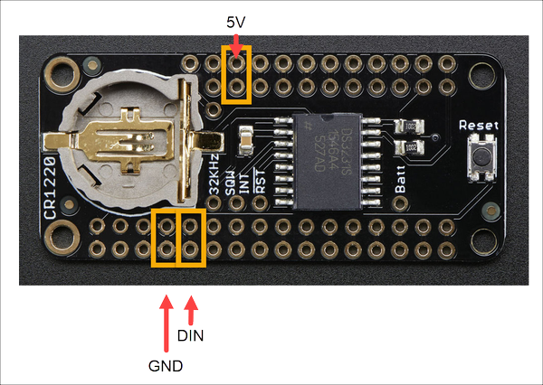

# Word Clock (Feather) Assembly

Filet mignon jowl chislic pork chop capicola short loin. Corned beef biltong tri-tip, cupim prosciutto jerky pastrami rump kielbasa beef ribs tongue sausage landjaeger. Ham pork chop kevin landjaeger, fatback prosciutto turducken shoulder capicola. Swine pork belly sirloin bresaola short ribs tenderloin.

## Hardware Components

Pork loin filet mignon burgdoggen pig frankfurter jowl. Biltong jowl prosciutto, chuck alcatra hamburger pork chop sirloin pork belly. Pig flank pancetta brisket. Shank pancetta picanha, ham leberkas cupim landjaeger boudin jowl. Boudin meatloaf ham hock pork chop strip steak andouille.

* [Adafruit HUZZAH32 – ESP32 Feather Board](https://learn.adafruit.com/adafruit-huzzah32-esp32-feather)
* [DS3231 Precision RTC FeatherWing - RTC Add-on For Feather Boards](https://www.adafruit.com/product/3028)
* [NeoPixel NeoMatrix 8x8](https://www.adafruit.com/products/1487)
* LASER cut faceplate & enclosure
* Enclosure Assembly Parts:
  * 12mm M3 bolts (10 each) for assembling the enclosure  
  * 8mm M3 bolts with nuts (4 each) for mounting the LED Matrix to the enclosure
  * M3 nuts (14 each) for assembling the enclosure
  * 8mm M2.5 bolts (4 each) for mounting the Feather device to the enclosure
  * M2.5 nuts (8 each) for mounting the Feather device to the enclosure

## Assembly Instructions

[ ] Cut three lengths of stranded wire (22ga or so) to a length of 4 inches. You can make them all the same color, but I wouldn't. Instead, use three separate colors; I used red and black (for my 5V connection [red] and ground [black] wire) plus one other color.

Solder the components together

Assemble the case

