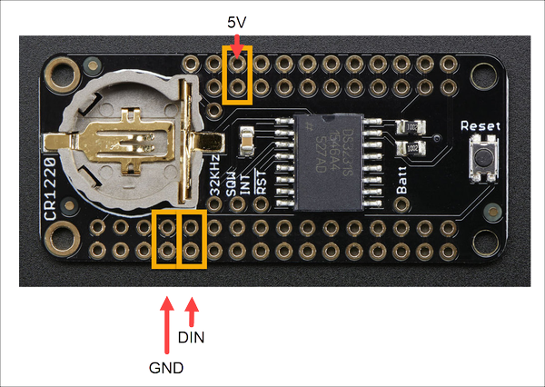

# World Clock NeoMatrix Wi-Fi Desktop Electronics Assembly

This document contains the complete instructions for assemblying the electronics components for the project. 

- [ ] Cut three lengths of stranded wire (22ga or so) to a length of 4 inches. You can use the same color for all, but I wouldn't (because this will just get confusing later on if you do). Instead, use three separate colors: red and black (for my 5V connection [red] and ground [black] wire) plus one other color.

- [ ] Look at the back of the NeoPixel Matrix board and locate the three connectors (highlighted in orange) to the right of the board name in the following figure. In the following three steps, you must use the highlighted connectors (the board has two sets of connectors, and if you use the wrong ones things just won't work correctly). 

The enclosure has an opening to accommodate wires connected to the highlighted connectors. If you use the wrong ones, the matrix will be unside-down in the enclosure, and the clock will never display the correct time. Get it right the first time, please.

- [ ] (Assuming you have red, black, and some other color wire) Strip 1/4 inch of insulation from both ends of the Black wire, then solder one end of the wire to the `GND` connector highlighted in the previous figure. 

- [ ] Strip 1/4 inch of insulation from both ends of the Red wire, then solder one end of the wire to the 5V connector highlighted in the previous figure.

- [ ] Strip 1/4 inch of insulation from both ends of the remaining wire, then solder one end of the wire to the DIN connector highlighted in the previous figure.

- [ ] Grab the DS3231 Precision RTC FeatherWing board and solder the male headers to the board. The easiest way to do this is to insert the bottom posts of the header (the longer pins) into a breadboard, then set the board on top of the exposed header pins (as shown in the following figure). Make sure you use the outside (closest to the edge of the board) holes for the headers as shown in the figure, then solder each of the pins to the board.

- [ ] On the DS3231 Precision RTC FeatherWing board, look for the connections highlighted in the following figure. 

**Note:** When I connected the wires to the board (described in the next three steps) I ran the wires up from the underside of the board and soldered them on the top

- [ ] Connect the exposed end of the Black wire to the GND Connection highlighted in the figure and solder it in place.

- [ ] Connect the exposed end of the Red wire to the 5V Connection highlighted in the figure and solder it in place.

- [ ] Connect the exposed end of the other color (mine is blue) wire to the DIN Connection highlighted in the figure and solder it in place. This is the A0 pin on the Feather.

When you're all done, the assembly should look similar to the following:

- [ ] Grab the Feather Huzzah32 board and insert the female headers through the pins on the top of the board as shown in the following figure. Next, solder the pins on the underside of the board.

- [ ] Stack the DS3231 Precision RTC FeatherWing board on top of the Feather Huzzah 32 as shown in the following figure:

- [ ] Finally, insert the CR1220 battery into the battery holder on top of the Feather assembly

---

To help validate correct assembly, I included a simple tester application with the project. To view instructions on how to test the hardware, refer to [Electronics Testing](electronics-testing.md). To skip testing the hardware and jump ahead to assembling the enclosure refer to [Enclosure Assembly](enclosure-assembly.md).