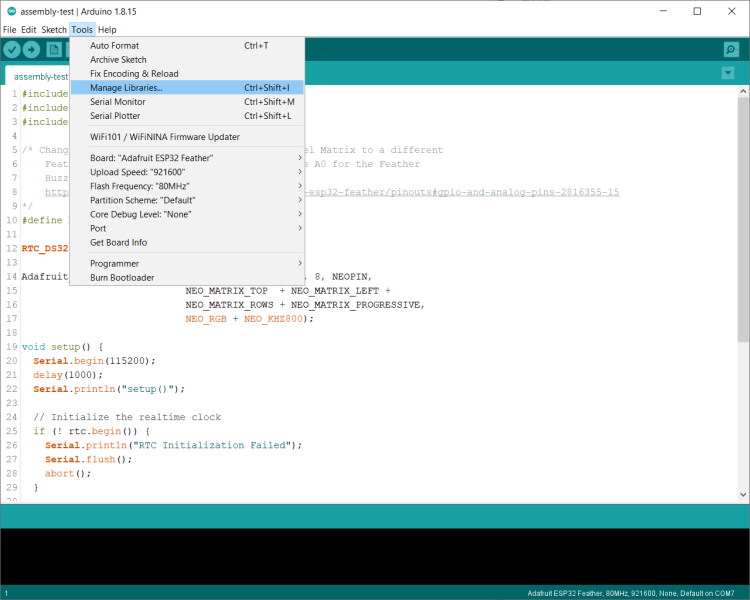
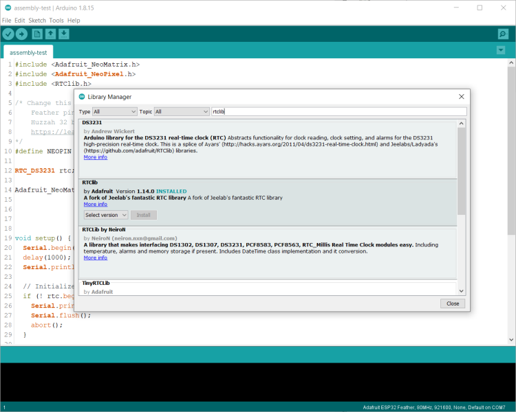

# Word Clock (Feather) Electronics Testing

This document contains the complete instructions for testing the electronics components for the project. For instructions on how to assemble the electronics, refer to [Electronics Assembly](electronics-assembly.md).

I added this document because I figured you'd want to test the hardware configuration before completing the enclosure assembly. To help you, I wrote a simple [test sketch](https://github.com/johnwargo/world-clock-neomatrix-8x8-wifi/tree/main/assembly-test) and included it with the project.

> You may have to tweak the configuration of the test sketch if you changed any of the hardware for the project or connected the NeoPixel Matrix to a different output port on the Feather device.

These instructions assume you're comfortible using the Arduino IDE (desktop or web) to compile and deploy Arduino sketches. I don't use the arduino Web IDE, so what you'll find here are instructions for the desktop IDE.

- [ ] Open the Arduino IDE, then open the Library Manager. To do this, in the IDE open the **Tools** menu, then **Manage Libraries** as shown in the following figure.

- [ ] Install the Adafruit NeoMatrix library, the Adafruit NeoPixel library, and the Adafruit version of the RTC Library (RTClib). 

- [ ] 

- [ ] 

- [ ] 

- [ ] 

- [ ] 

- [ ] 

- [ ] 

- [ ] 

- [ ] 

- [ ] 

- [ ] 

- [ ] 

- [ ] 

- [ ] 

- [ ] 

