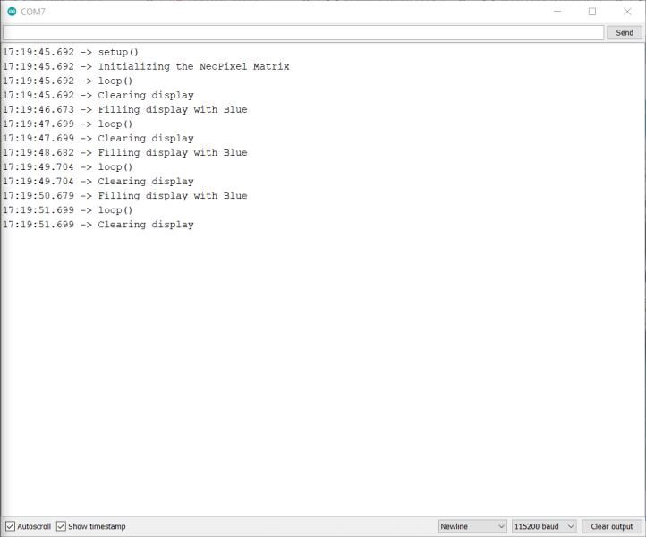

# Word Clock (Feather) Electronics Testing

This document contains the complete instructions for testing the electronics components for the project. For instructions on how to assemble the electronics, refer to [Electronics Assembly](electronics-assembly.md).

I added this document because I figured you'd want to test the hardware configuration before completing the enclosure assembly. To help you, I wrote a simple [test sketch](https://github.com/johnwargo/world-clock-neomatrix-8x8-wifi/tree/main/assembly-test) and included it with the project.

> You may have to tweak the configuration of the test sketch if you changed any of the hardware for the project or connected the NeoPixel Matrix to a different output port on the Feather device.

These instructions assume you're comfortible using the Arduino IDE (desktop or web) to compile and deploy Arduino sketches. I don't use the arduino Web IDE, so what you'll find here are instructions for the desktop IDE.

- [ ] Connect the electronics assembly to the computer system using a USB cable.

- [ ] Open the Arduino IDE, then open the test sketch located in the repositories `assembly-test` folder. The sketch is called, unsurprisingly, `assembly-test.ini`.

- [ ] In the Arduino IDE, open the Library Manager. To do this, open the **Tools** menu, then select **Manage Libraries** as shown in the following figure.


- [ ] Install the **Adafruit NeoMatrix** library, the **Adafruit NeoPixel** library, and the Adafruit version of the **RTC** Library (RTClib). An example of the RTC Library is shown in the following figure. There are multiple RTC libraries, so make sure you select (and install) the right one.


- [ ] At the top of the sketch, you'll see a define called `NEOPIN`; if you assembled the electronics components as instructed in the documentation, you won't need to make any changes here. If you connected the NeoMatrix to a different output pin on the Feather, you'll need to change the value here accordingly. 

The Pinout labeling on the Feather is a little weird - the instructions I provided tell you to connect the NeoMatrix `DIN` to `A0` on the Feather, but that actually corresponds to GPIO 26 which is what you see in this define.

- [ ] Later in the sketch, you'll see the following code:

```c
Adafruit_NeoMatrix matrix = Adafruit_NeoMatrix(8, 8, NEOPIN,
                            NEO_MATRIX_TOP  + NEO_MATRIX_LEFT +
                            NEO_MATRIX_ROWS + NEO_MATRIX_PROGRESSIVE,
                            NEO_RGB + NEO_KHZ800);

```

This is the code that initializes the NeoMatrix. If you're using the NeoMatrix board listed in the [Hardware Components](https://github.com/johnwargo/world-clock-neomatrix-8x8-wifi#hardware-components) section of the repository's `readme.md` file, then you won't need to make any changes here. If you're using different hardware, you must adjust the initialization code to accommodate your hardware configuration using the instructions provided in [Arduino Library Use](https://learn.adafruit.com/adafruit-neopixel-uberguide/arduino-library-use).

- [ ] Configure the IDE for the Feather board configuration, setting the Board, Port, and Programmer as described in the [Adafruit HUZZAH32 - ESP32 Feather](https://learn.adafruit.com/adafruit-huzzah32-esp32-feather) documentation. 

- [ ] Compile and deploy the sketch to the device. When the device reboots, the NeoMatrix will simultaneously blink all of its LEDs blue (one second on, one second off) until you remove power or replace the sketch with something. If the LEDs don't blink, then you have some hardware troubleshooting to do.

- [ ] To see what's going on in the sketch, open the IDE's Serial Monitor and it will display similar information to what's shown in the following figure (I changed the output after I took the screen shot, so it will be slightly off):



If the sketch cannot detect the RTC, it will display a message in the monitor then abort the sketch - this will be clearly reflected in the Serial Monitor's output. This too is something you'll have to troubleshoot on your own. 