# World Clock NeoMatrix Wi-Fi Desktop Enclosure Assembly

This documnet contains the complete instructions for assembling the Word Clock enclosure (assuming you use the enclosure plans included with this project).

**Note:** I asked [Muzammil Patel](https://www.fiverr.com/muzammil_patel) on Fiverr to adjust the original project's enclosure to accommodate the Feather line of Microcontrollers. He added additional bolt holes and moved the USB Connector opening. Unfortunately, even though the folks at Adafruit published a specification for the [Feather](https://learn.adafruit.com/adafruit-feather/feather-specification) series of microcontroller boards, they've not done a very good job sticking with that specification. For the Feather Huzzah boards (both the ESP8266 and ESP32), they adjusted the size and position of the two bolt holes on the opposite side of the board from the USB connector. I hope to have an updated version of the design that accommodates different size feathers, but if I don't you may have to tweak the enclosure holes to fit the Feather board you selected for this project.

I used [Ponoko](https://www.ponoko.com/) to LASER cut the enclosure for me, I love those guys and they usually do a great job for me. When you look at the enclosure pieces, they'll start looking something like this:

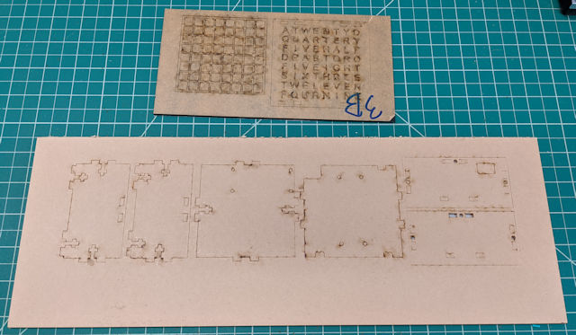

- [ ] Ponoko uses a big piece of masking tape to hold the pieces together. Remove that tape and all of the parts fall out. The faceplate and the grid protector drop a lot of little parts, so make sure you do this over a table or desktop so you can collect the extra bits and throw them away (or keep them for some other project).

- [ ] The enclosure pieces have even more tape on both sides of each piece, so you must peel those off of both sides of the pieces before continuing. You can see the tape in the following image.

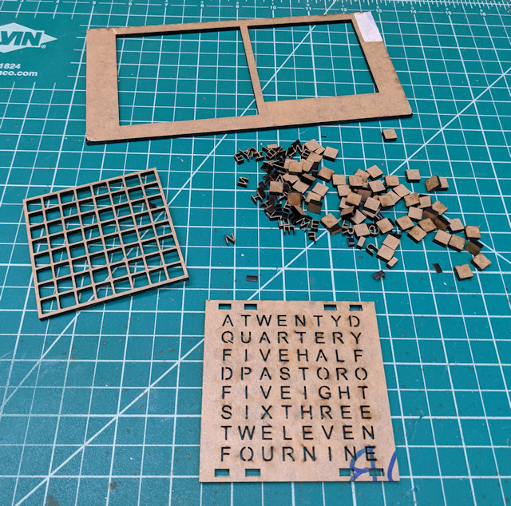

- [ ] Mount the NeoMatrix to to the enclosure's top panel using 4 M3x8mm machine screws/bolts as shown in the following figure. I pushed the bolts through the top of the NeoMatrix so they'd sit flush with the top of the board, if you did it the other way, the nuts would cover part of the NeoMatrix's NeoPixels. 

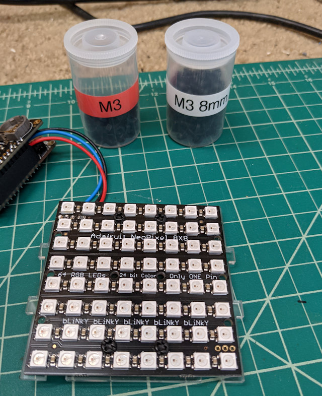

The three wires connecting the Feather assembly to the NeoMatrix fit through a special notch in the enclosure; the wires should not be pressed up against the enclosure anywhere, they should have an unencumbered position off the back of the NeoMatrix as shown in the following image:

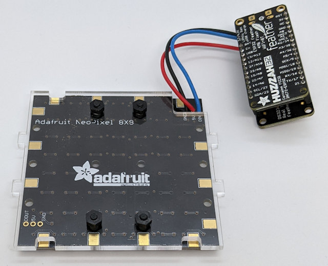

- [ ] Next, mount the Feather Assembly on the enclosure bottom as shown in the following image. You can use 2 M2.5x10mm or M2.5x12mm bolts for the holes near the USB connector. Depending on the Feather board you select, you may be able to use the same size bolts for the other holes, but for the Feather Huzzah boards you will need M2x10 or M2x12mm bolts.

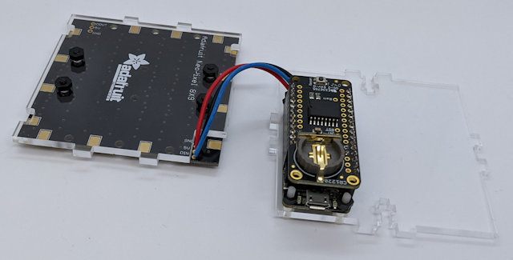

**Note:** I found that I had to tweak the Huzzah board to fit the bolts through the holes. The Huzzah boards have a Wi-Fi antenna covering part of the mounting holes, so I had to use a drill to drill through the holes and antenna to allow clear passage. Be careful doing this; you must make sure you don't cut the antenna traces when you do this - only drill through the edge of the antenna panel to open a space for the bolts.

- [ ] Mount the enclosure's end panel over the end of the board with the USB connector as shown in the following image. Use an M3x12mm bolt and nut to complete the installation as shown in the figure.

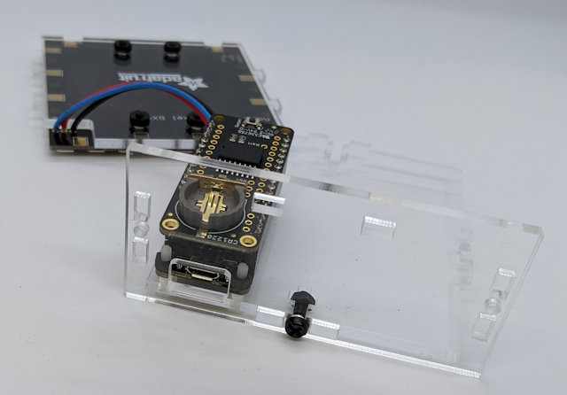

- [ ] Mount one of the side panels to the assembly as shown in the following figure. Use an M3x12mm bolt and nut to complete the installation as shown in the figure.

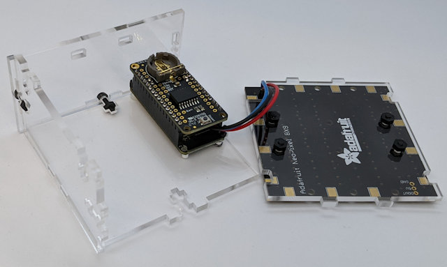

- [ ] Repeat the same process for the other side panel as shown in the following figure. 

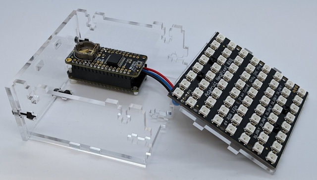

At this point, only three sides of the enclosure are assembled; you need that remaining end open as you fit in the NeoMatrix panel into the enclosure.

- [ ] Slide the assembled NeoMatrix panel into the assembled enclosure with the upper-left corner of the NeoMatrix on the same side as the Feather assembly as shown in the following image. Next, insert the remaining side panel and use three M3x12mm bolts and nuts to hold the panels together. 

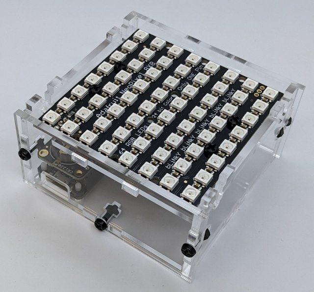

This is where some of this gets tricky because you'll probably start dropping nuts into the enclosure as you try to fit it all together. What did when assembling this was to hold the assumbly upside down (with the nut opening pointing down), with the assembly in this position, I could push the nut into the slot and hold it in place via gravity as I inserted the bolt and twisted it in place. 

- [ ] If you 3D printed the pixel guard  (shown in the following figure) then skip this step. If you LASER cut the piece you have some extra work to do before you can complete assembly. When you place the grid over the NeoMatrix, you should notice that the bolt heads mounting the NeoMatrix to the enclosure keep the pixel guard from resting evenly against the NeoMatrix. You must cut or grind the underside of the pixel guard to make room for the bolts. If you look closely at the picture, you can see the indentations I cut into the pixel guard using a Dremel. 

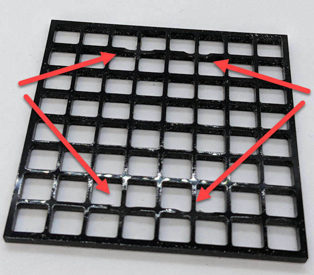

- [ ] Using the pixel guard as a template, cut a piece of white paper to the dimensions of the pixel guard. Place the pixel guard on top of the NeoMatrix, then place the piece of paper on top of the pixel guard as shown in the following image.

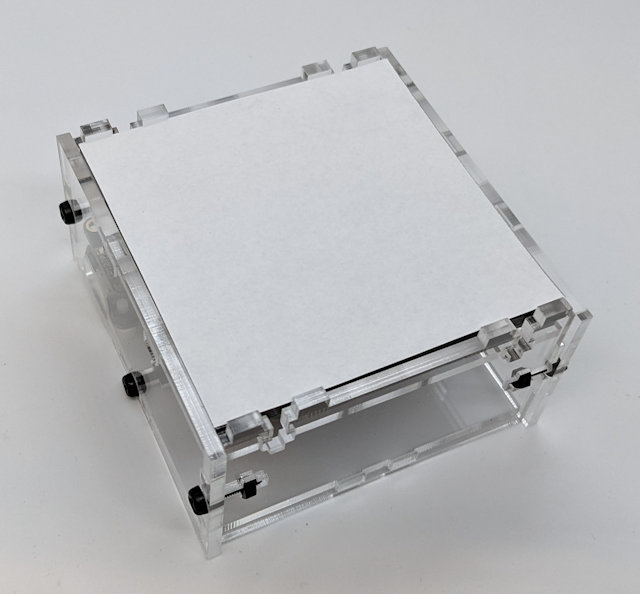

- [ ] Finally, mount the Word Clock face on top of the enclosure using 4 M3x12mm bolts and nuts to complete the installation as shown in the figure.

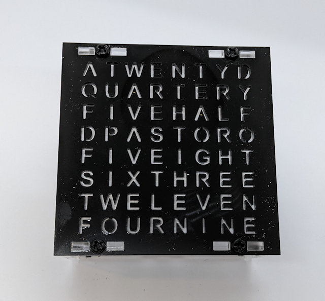

Here's a picture of the completely assembled and operational word clock.

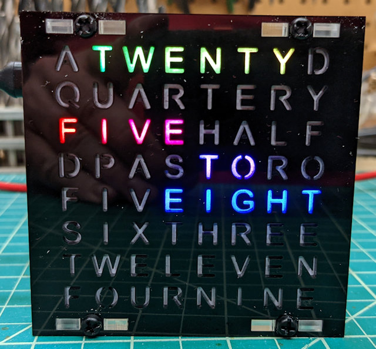

---

The next step is to install the Word Clock sketch to the device; for complete instructions, refer to [Software](software.md).