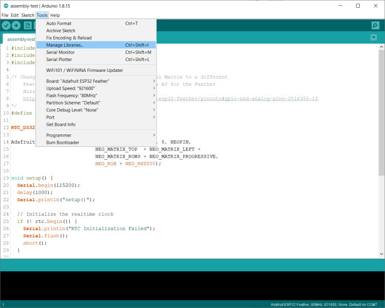
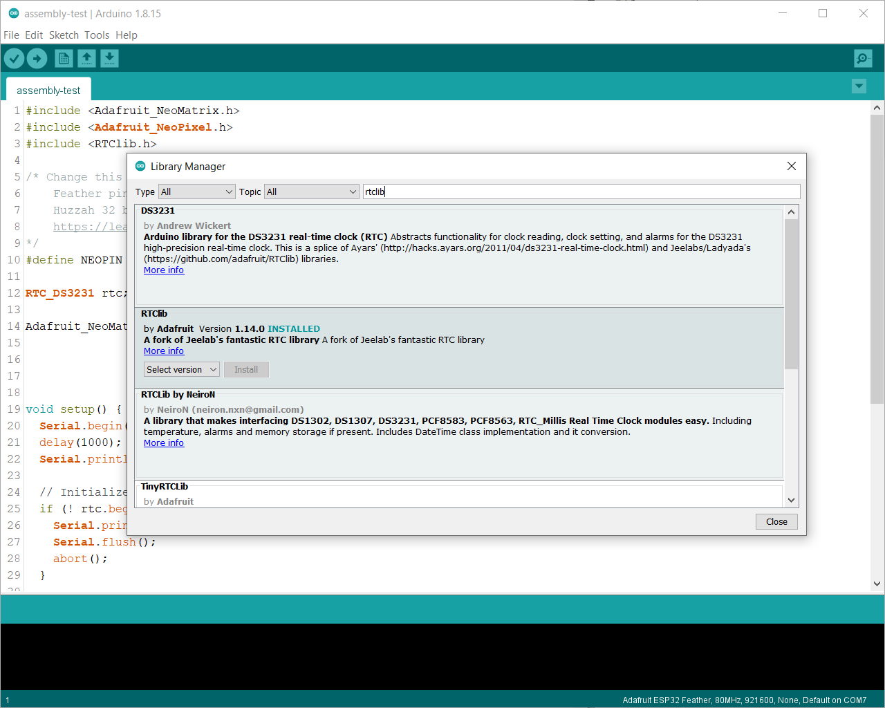

# Word Clock (Feather) Software Configuration

This document contains information about the software configuration for the Word Clock. 

## Required Libraries

This project uses the following Arduino libraries:

- [RTClib](https://github.com/adafruit/RTClib)
- [DST_RTC](https://github.com/andydoro/DST_RTC)
- [Adafruit_GFX](https://github.com/adafruit/Adafruit-GFX-Library)
- [Adafruit_NeoPixel](https://github.com/adafruit/Adafruit_NeoPixel)
- [Adafruit_NeoMatrix](https://github.com/adafruit/Adafruit_NeoMatrix)

To Install the libraries:

- [ ] Open the Arduino IDE, then open the Library Manager. To do this, open the **Tools** menu, then select **Manage Libraries** as shown in the following figure.



- [ ] Locate each required library individually (its easiest to use Search) then install it into the IDE. 

**Note:** There are multiple RTC libraries, so make sure you select (and install) the right one.



## Sketch Configuration

When I forked the original project, I pulled all of the configuration settings into a separate file, then hid that file from the repository. I then made a copy of the configuration file under a different name and included that file in the repository. I did this because if I kept the 'real' configuration file in the repo, after you make changes in the file to support your needs, any subsequent update from the repository would overwrite your changes. 

Before you try to compile and deploy the project's code, you must first copy the `config.copyme` file to `config.h`. When you're done, you'll have both files in the folder. The `config.copyme` is part of the source code repository, so any time you pull updates or changes down from GitHub, it may overwrite that file. You can make whatever changes you want to the `config.h` file, and they won't be overwritten when you update the source code from the Internet.

To do this on Microsoft Windows, you can open Windows Explorer (the file system browser app) and copy it there.  If you're comfortable with the command line, you can open a Command Prompt, navigate to the project folder, and execute the following command:

```shell
copy config.copyme config.h
```

On Linux and macOS, open a terminal window, navigate to the project folder, and execute the following command:

```shell
cp config.copyme config.h
```

**Note:** If you ever refresh your local files from the repository, you may want to check the project's `changelog.md` file for any new configuration settings you'll need to copy over to your project's `config.h` file.

## Configuration Settings

The following sections describe the different configuration options for the project. I tried to break them up into groups to make it easier to find the settings you're looking for. 

**Note:** Many of the settings are defined as C language `#define` components. According to the [Arduino Documentation](https://www.arduino.cc/reference/en/language/structure/further-syntax/define/):

> `#define` is a useful C++ component that allows the programmer to give a name to a constant value before the program is compiled. Defined constants in arduino don’t take up any program memory space on the chip. The compiler will replace references to these constants with the defined value at compile time.

As you modify these settings, pay special attention to the format of the constant. For example, they're not code, so there's no need to end the line with a semi-colon (;). Strings, however, must be in double quotes.

### Host Setting

The Arduino WiFi library allows a sketch to set the device name before initializing the Wi-Fi connection. With this value set, the device identifies itself on the network with this name. [Arduino Documentation](https://www.arduino.cc/en/Reference/WiFiNINAsetHostname).

```c
#define HOST_NAME "Word Clock (ESP32)"
```

### LED Settings

The project allows you to set LED brightness for day and night through these two constants:

```c
#define DAYBRIGHTNESS 40
#define NIGHTBRIGHTNESS 20
```

You can also control the cutoff time (in hours) for day and night through these two constants:

```c
#define MORNINGCUTOFF 7  // when does daybrightness begin?   7am
#define NIGHTCUTOFF   22 // when does nightbrightness begin? 10pm
```

When the sketch starts, you can have it flash each word on the display for the number of milliseconds defined in this constant.

```c
#define FLASHDELAY 250  // delay for startup "flashWords" sequence
``` 

While the sketch displays time, the colors behind the words shift over time; this constant defines how many milliseconds pass between each color shift.

```c
#define SHIFTDELAY 100   // controls color shifting speed
```

### NeoPixel Settings


```c
#define NEOPIN 26  
```


If using three-color (RGB) LEDs in your NeoMatrix, use the following
#define LED_CONFIG NEO_GRB + NEO_KHZ800
If using the four-color (RGBW) LEDs in your NeoMatrix, use the following
#define LED_CONFIG NEO_GRBW + NEO_KHZ800
If using Pixels wired for RGB bitstream (v1 FLORA pixels, not v2), use the following

```c
#define LED_CONFIG NEO_GRBW + NEO_KHZ800
```

```c
#define LED_CONFIG NEO_RGB + NEO_KHZ800
```

### Network Settings


```c
#define WIFI_SSID ""
#define WIFI_PSWD ""
```


```c
#define WIFI_TIMEOUT 10 //seconds
```


### Time Settings

Do you live in a country or territory that observes Daylight Saving Time?
https://en.wikipedia.org/wiki/Daylight_saving_time_by_country
Use 1 if you observe DST, 0 if you don't. This is programmed for DST in the US / Canada. If your territory's DST operates differently,
you'll need to modify the code in the calcTheTime() function to make this work properly.

```c
#define OBSERVE_DST 1
```

NTP returns the current time as Greenwich Mean Time (GMT), so to
display the current time for your time zone, you must provide an
offset value that's automatically added to the time returned from
NTP. Enter a value below calculated based on your current time
zone difference from GMT as follows:

GMT_OFFSET * 3600

For example, I live in GMT-5, so I'd calculate mine as:

   -5 * 3600 = -18000

Examples:

-5 = -18000
-4 = -14400
-3 = -10800
-2 = -7200
-1 = -3600
0 (GMT) = 0
+1 = 3600
+2 = 7200
+3 = 10800
+4 = 14400
+5 = 18000

```c
#define GMT_OFFSET 0  
```

// Comment out the following line to display Date/Time values (in the monitor)
// in European format
```c
#define USE_US_DATE_TIME_FORMAT
```


// Define US or EU rules for DST comment out as required. More countries could be added with different rules in DST_RTC.cpp
```c
const char rulesDST[] = "US"; // US DST rules
// const char rulesDST[] = "EU";   // EU DST rules
```

```c
// const char rulesDST[] = "US"; // US DST rules
const char rulesDST[] = "EU";   // EU DST rules
```


